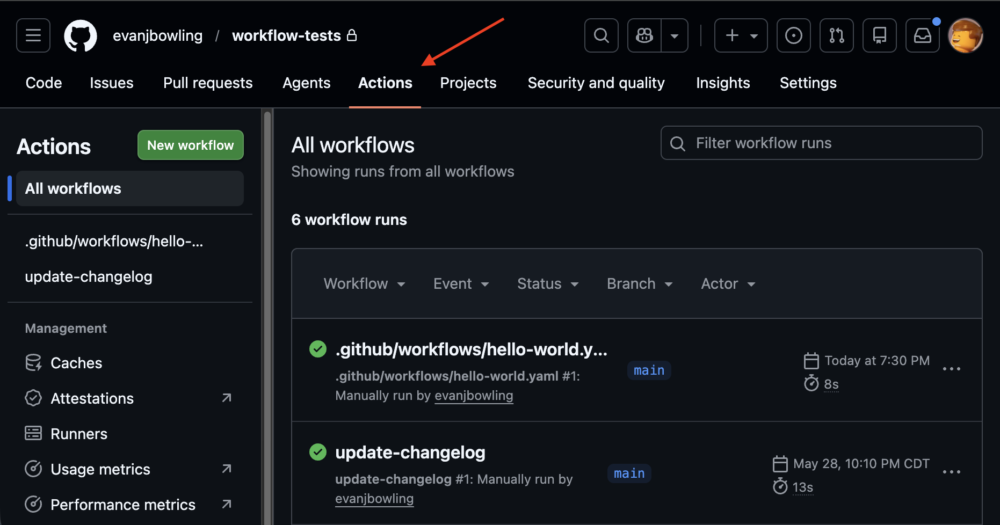

# GitHub Actions is a terrible name

# What is it?

GitHub Actions provides a way to create CI/CD
automation with code (GitOps instead of ClickOps).

# What does it look like?



# Getting Started

Here's the simplest ~~action~~ workflow I could create:

```yaml
on:
  workflow_dispatch:

jobs:
  hello:
    runs-on: ubuntu-latest
    steps:
      - name: Print Hello
        run: echo "Hello World!"
```

## Getting Started

Here's the simplest ~~action~~ workflow I could create:

```yaml
on:                  # this configures when the workflow runs
  workflow_dispatch: # this let's you run the workflow manually from UI or API

jobs:
  hello:
    runs-on: ubuntu-latest
    steps:
      - name: Print Hello
        run: echo "Hello World!"
```

## Getting Started

Here's the simplest ~~action~~ workflow I could create:

```yaml
on:                  # this configures when the workflow runs
  workflow_dispatch: # this let's you run the workflow manually from UI or API

jobs:                # a workflow has jobs (not actions)
  hello:             # this workflow has one job "hello"
    runs-on: ubuntu-latest
    steps:
      - name: Print Hello
        run: echo "Hello World!"
```

## Getting Started

Here's the simplest ~~action~~ workflow I could create:

```yaml
on:                  # this configures when the workflow runs
  workflow_dispatch: # this let's you run the workflow manually from UI or API

jobs:                # a workflow has jobs (not actions)
  hello:             # this workflow has one job "hello"
    runs-on: ubuntu-latest
    steps:                     # a job has steps (which _can_ be an action)
      - name: Print Hello      # this job has one step (which is *not* an action)
        run: echo "Hello World!"
```

# How does it work?

Events trigger workflows. Workflows have a structure like:
```
  Workflow (top-level name:)
  └── Job 1 (job name: or job ID)
      ├── Step 1
      ├── Step 2
  └── Job 2 (job name: or job ID)
      ├── Step 1
      ├── Step 2
```

## How does the example work?

Created `.github/workflows/hello-world.yaml`

```
  Workflow (no name attribute - just uses the filename as the name)
  └── Job (name: hello)
      ├── Step (name: Print Hello)
```

#


# A Better Example

```yaml
name: update-changelog

on:
  pull_request:
    types:
      - closed
    branches:
      - main
  workflow_dispatch:

jobs:
  update-changelog:
    if: github.event_name == 'workflow_dispatch' || github.event.pull_request.merged == true
    runs-on: ubuntu-latest
    permissions:
      contents: write

    steps:
      - name: Checkout Code
        uses: actions/checkout@v4
      - name: Update CHANGELOG.md
        run: |
          touch CHANGELOG.md
          TIMESTAMP=$(date -u +"%Y-%m-%dT%H:%M:%SZ")
          ENTRY="## version ${TIMESTAMP}"$'\n'
          if [ -s CHANGELOG.md ]; then
            echo -e "${ENTRY}\n$(cat CHANGELOG.md)" > CHANGELOG.md
          else
            echo "${ENTRY}" > CHANGELOG.md
          fi  
          git config user.name "github-actions[bot]"
          git config user.email "github-actions[bot]@users.noreply.github.com"
          git add CHANGELOG.md
          git commit -m "chore: update CHANGELOG.md"
          git push
```


